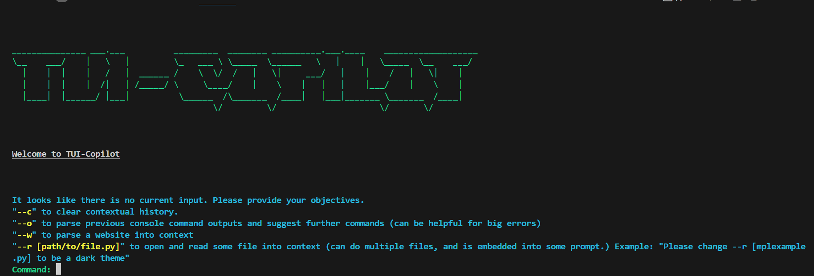

# TUI-copilot
Giving LLMs access to Terminals 🧑‍💻

TUI-Copilot is a Terminal User Interface (TUI) program designed to assist users with executing console commands in a guided manner. It currently leverages OpenAI's GPT-3.5 model to provide suggestions for commands based on user input and context.

## How to Use

1. Clone the repository to your local machine.
2. Ensure you have Python installed.
3. Install the required dependencies using `pip install -r requirements.txt`.
4. Run the program using `python main.py`.
5. Follow the on-screen instructions to input objectives and receive command suggestions.

## Usage Examples

1. Guided execution of console commands.
2. Parsing website content to generate relevant commands.
3. Embedding file content into prompts for context-aware suggestions.

## License

This project is licensed under the [MIT License](LICENSE).
